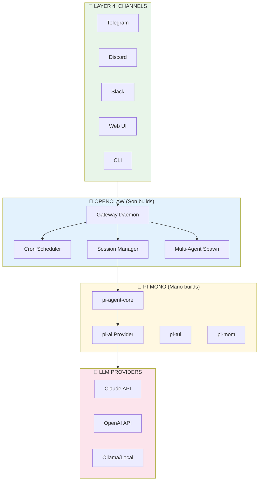
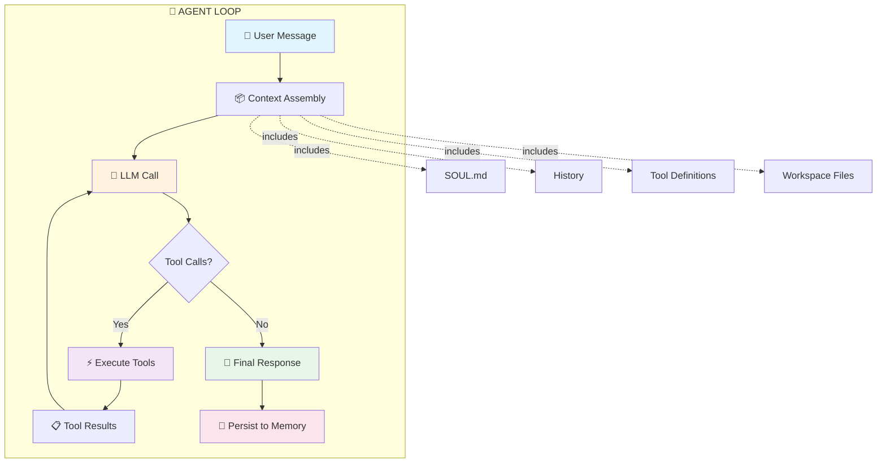
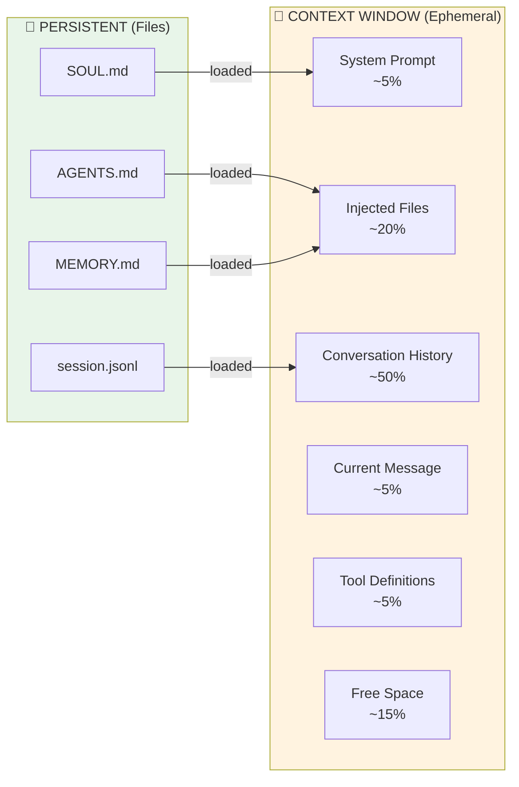
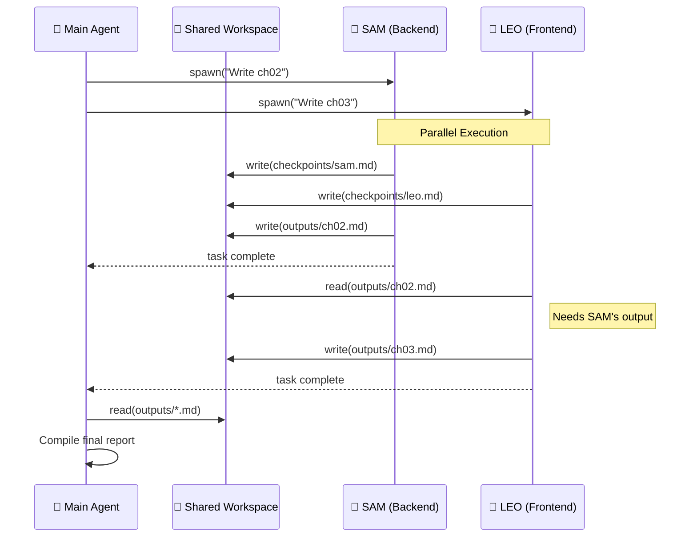
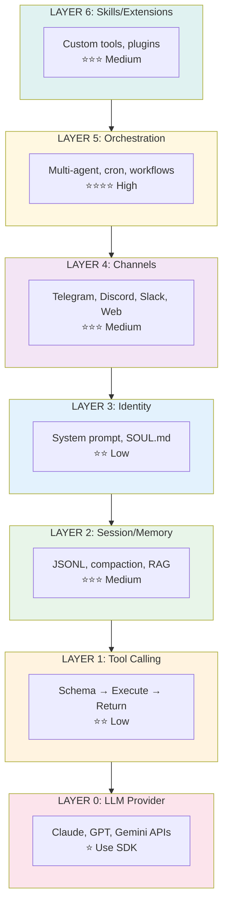
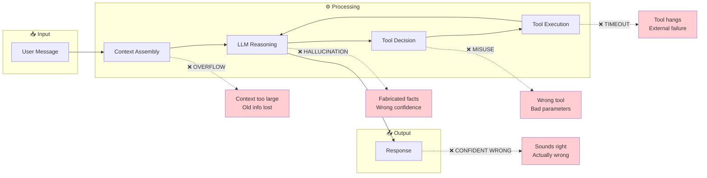

# How I Work — Từ Zero đến AI Agent

*Tài liệu kỹ thuật về kiến trúc OpenClaw, viết cho người muốn hiểu sâu hoặc tự build agent từ đầu.*

---

## Mục Lục

1. [Foundation — Pi-mono & Agent Runtime](#phần-1-foundation--pi-mono--agent-runtime)
2. [OpenClaw Layer — Từ Runtime đến Product](#phần-2-openclaw-layer--từ-runtime-đến-product)
3. [LLM — Bộ Não](#phần-3-llm--bộ-não-của-bạn)
4. [Tạo AI Agent Từ Số 0](#phần-4-tạo-ai-agent-từ-số-0)

---

## Overview: Full Architecture Stack

Trước khi đi vào chi tiết, đây là toàn cảnh kiến trúc từ dưới lên:



**Boundary rõ ràng**: Mario build engine (Pi-mono), OpenClaw build car (Gateway + Channels + Orchestration). LLM providers là "não" bên ngoài mà cả hai đều gọi.

---

# PHẦN 1: FOUNDATION — Pi-mono & Agent Runtime

## 1.1 Pi-mono là gì và tại sao nó tồn tại?

### Vấn đề Mario Zechner giải quyết

Trước pi-mono, muốn chạy AI agent locally bạn phải:
- Tự viết agent loop từ đầu
- Tự handle tool calling, context management
- Tự integrate với terminal, browser, file system
- Mỗi người làm một cách, không chuẩn hóa

Mario (creator của libGDX, ex-Google engineer) nhận ra pattern chung: **mọi coding agent đều cần cùng một bộ infrastructure**. Pi-mono là attempt để standardize layer đó.

### Kiến trúc Monorepo

```
pi-mono/
├── packages/
│   ├── @anthropic/claude-code    # Anthropic's official coding agent CLI
│   ├── pi-agent-core             # Core agent loop, tool execution
│   ├── pi-ai                     # LLM provider abstraction (Anthropic, OpenAI, etc.)
│   ├── pi-tui                    # Terminal UI components
│   ├── pi-coding-agent           # Mario's coding agent implementation
│   ├── pi-mom                    # "Master of Masters" - multi-agent orchestration
│   └── pi-web-ui                 # Web interface
```

**Mỗi package làm gì:**

| Package | Vai trò |
|---------|---------|
| `pi-agent-core` | Agent loop, tool registry, context assembly. Đây là trái tim. |
| `pi-ai` | Abstraction layer cho LLM APIs. Switch giữa Claude/GPT/Gemini mà không đổi code. |
| `pi-tui` | Terminal UI: input handling, markdown rendering, progress indicators. |
| `pi-coding-agent` | Implementation cụ thể cho coding tasks. |
| `pi-mom` | Multi-agent coordination — spawn và quản lý nhiều agents. |
| `@anthropic/claude-code` | Anthropic's official fork, maintained by Anthropic team. |

### Tại sao TypeScript? Tại sao Monorepo?

**TypeScript:**
- Strong typing cho tool schemas — quan trọng vì LLM cần exact function signatures
- Ecosystem mature (Node.js) — dễ integrate với file system, shell, network
- Async/await natural — agent loop inherently async (wait for LLM, wait for tools)

**Monorepo:**
- Shared dependencies — một version của `docx`, `puppeteer`, etc.
- Cross-package imports không cần publish to npm
- Atomic changes — update core + all consumers trong một commit
- Pnpm workspaces — efficient disk usage, fast installs

---

## 1.2 Agent Loop — Trái tim của mọi AI Agent

### Khi bạn gửi message, chuyện gì xảy ra?



**Điểm quan trọng**: Khi LLM trả về `tool_calls`, agent execute rồi **quay lại LLM** với kết quả. Loop này có thể lặp 1-50 lần tùy task complexity. Chỉ khi LLM trả về response không có tool calls thì mới kết thúc.

### Bước chi tiết:

**1. Context Assembly** (~100ms)
```typescript
const context = {
  system: await loadSystemPrompt(),     // SOUL.md + runtime info
  messages: await loadHistory(session), // Previous turns
  tools: getToolDefinitions(),          // Available functions
  files: await injectWorkspaceFiles(),  // AGENTS.md, USER.md, etc.
};
```

**2. LLM Call** (~2-30 seconds depending on complexity)
```typescript
const response = await llm.complete({
  model: "claude-sonnet-4-20250514",
  messages: context.messages,
  system: context.system,
  tools: context.tools,
  max_tokens: 16000,
});
```

**3. Tool Execution** (variable)

LLM returns something like:
```json
{
  "content": "Let me check that file for you.",
  "tool_calls": [
    {
      "name": "Read",
      "parameters": { "path": "/Users/son/code/app.ts" }
    }
  ]
}
```

Agent executes tool, gets result, appends to context, calls LLM again.

**4. Loop Until Done**

LLM continues calling tools until it returns a final response with no `tool_calls`. This could be 1 loop or 50 loops.

### Agent vs Chatbot — Sự khác biệt

| Aspect | Chatbot (ChatGPT Web) | Agent (OpenClaw) |
|--------|----------------------|------------------|
| **Tools** | Limited (browsing, DALL-E, code interpreter) | Full filesystem, shell, browser, any API |
| **Environment** | Sandboxed cloud | Your local machine |
| **Persistence** | Their servers | Your files |
| **Loop** | Single turn | Multi-turn with tool execution |
| **Autonomy** | Answer questions | Complete tasks |

### Khái niệm "Agentic"

"Agentic" means the AI can:
1. **Observe** — Read files, check state, browse web
2. **Think** — Reason about what to do next
3. **Act** — Execute commands, write files, call APIs
4. **Loop** — Repeat until task complete

Chatbot: Input → Output
Agent: Input → Observe → Think → Act → Observe → Think → Act → ... → Output

**Tại sao quan trọng?**

Vì tasks thực tế không phải single-shot. "Build me a website" cần:
- Read existing code
- Plan architecture
- Write multiple files
- Run dev server
- Check browser
- Fix errors
- Iterate

Không agent nào làm được điều này trong 1 turn.

---

## 1.3 Tool Calling — Cách tôi "làm việc" thật sự

### Kỹ thuật hoạt động

**Step 1: Tool Definition (Schema)**

Mỗi tool được define như một JSON Schema:

```typescript
const readTool = {
  name: "Read",
  description: "Read the contents of a file",
  parameters: {
    type: "object",
    properties: {
      path: {
        type: "string",
        description: "Path to the file"
      },
      offset: {
        type: "number",
        description: "Line number to start reading"
      },
      limit: {
        type: "number",
        description: "Max lines to read"
      }
    },
    required: ["path"]
  }
};
```

**Step 2: LLM Generates Tool Call**

LLM được train để output structured tool calls khi cần:

```json
{
  "type": "tool_use",
  "name": "Read",
  "parameters": {
    "path": "/Users/son/app.ts",
    "limit": 100
  }
}
```

**Step 3: Validation + Execution**

```typescript
// Validate against schema
const valid = ajv.validate(tool.parameters, call.parameters);
if (!valid) throw new ValidationError(ajv.errors);

// Execute
const result = await toolExecutors[call.name](call.parameters);

// Return to LLM
return {
  type: "tool_result",
  tool_use_id: call.id,
  content: result
};
```

### Tools tôi có

| Category | Tools | Description |
|----------|-------|-------------|
| **Filesystem** | Read, Write, Edit | Đọc/ghi/sửa files |
| **Shell** | exec, process | Chạy commands, manage processes |
| **Browser** | browser (Playwright) | Navigate, click, screenshot, scrape |
| **Search** | web_search, web_fetch | Brave Search API, fetch URLs |
| **Memory** | memory_search, memory_get | Semantic search trong memory files |
| **Messaging** | message, tts | Send messages, text-to-speech |
| **Scheduling** | cron | Schedule jobs, reminders |
| **Multi-agent** | sessions_spawn, sessions_send | Spawn sub-agents, cross-session messaging |
| **System** | gateway, nodes | Control OpenClaw, paired devices |

### Khi nào dùng tool vs chỉ trả lời?

Quyết định này do LLM, dựa trên:

1. **System prompt guidance**: "Use web_search for current information"
2. **Task nature**: "What's in my package.json?" → cần Read
3. **Confidence**: Nếu tôi biết chắc → trả lời trực tiếp
4. **Freshness**: Facts có thể outdated → search

Tôi không có hard rules — đây là learned behavior từ training + prompt.

### RPC Mode là gì?

**Standard Mode**: LLM generates text stream → client displays incrementally

**RPC Mode**: LLM generates JSON responses → client parses and executes

OpenClaw dùng RPC mode vì:
- **Structured output**: Tool calls as JSON, not embedded in text
- **Cleaner parsing**: No need to extract code blocks from markdown
- **Faster tool execution**: Know immediately when tool call complete

```typescript
// RPC response format
{
  "type": "message",
  "content": [
    { "type": "text", "text": "Let me check..." },
    { "type": "tool_use", "name": "Read", "parameters": {...} }
  ],
  "stop_reason": "tool_use"  // Indicates more work needed
}
```

---

# PHẦN 2: OPENCLAW LAYER — Từ Runtime đến Product

## 2.1 OpenClaw thêm gì trên Pi-mono?

### Analogy

```
Pi-mono = Engine (Ford Coyote V8)
OpenClaw = Car (Ford Mustang)
```

Engine là core power. Car adds:
- Body (multi-channel interface)
- Transmission (message routing)
- Dashboard (status, monitoring)
- Ignition system (daemon, auto-start)

### Gateway Daemon

Gateway là background process chạy 24/7:

```
┌─────────────────────────────────────────────┐
│                  GATEWAY                     │
├─────────────────────────────────────────────┤
│                                              │
│  ┌──────────┐  ┌──────────┐  ┌──────────┐   │
│  │ Telegram │  │ Discord  │  │  Slack   │   │
│  │  Plugin  │  │  Plugin  │  │  Plugin  │   │
│  └────┬─────┘  └────┬─────┘  └────┬─────┘   │
│       │             │             │          │
│       └─────────────┼─────────────┘          │
│                     ▼                        │
│            ┌──────────────┐                  │
│            │   ROUTER     │                  │
│            │  (Session    │                  │
│            │   Manager)   │                  │
│            └──────┬───────┘                  │
│                   ▼                          │
│            ┌──────────────┐                  │
│            │  AGENT CORE  │                  │
│            │  (Pi-mono)   │                  │
│            └──────────────┘                  │
│                                              │
│  ┌──────────┐  ┌──────────┐  ┌──────────┐   │
│  │   CRON   │  │  MEMORY  │  │  CANVAS  │   │
│  │ Scheduler│  │  Search  │  │   (UI)   │   │
│  └──────────┘  └──────────┘  └──────────┘   │
│                                              │
└─────────────────────────────────────────────┘
```

**Gateway quản lý:**
- Channel connections (keep Telegram bot alive)
- Session lifecycle (create, persist, compact)
- Cron jobs (scheduled wakeups)
- Tool routing (which tools available for which agent)
- Config hot-reload
- Update mechanism

**Tại sao cần daemon?**

Không có daemon:
- Phải manually start agent mỗi lần
- Channels disconnect khi terminal closes
- Không scheduled tasks
- Không persistent sessions across restarts

### Multi-Channel Routing

```typescript
// Incoming message from any channel
interface InboundMessage {
  channel: "telegram" | "discord" | "slack" | "signal" | "direct";
  userId: string;
  chatId: string;
  text: string;
  media?: Attachment[];
}

// Router determines session
function routeMessage(msg: InboundMessage): SessionKey {
  return `channel:${msg.channel}:${msg.chatId}`;
  // E.g., "channel:telegram:498509454"
}
```

**Each channel = different session** by default. Telegram chat với Discord chat = 2 sessions riêng, 2 histories riêng.

### Cron System

```typescript
// Example cron job
{
  "name": "morning-briefing",
  "schedule": { 
    "kind": "cron", 
    "expr": "0 8 * * *",  // 8 AM daily
    "tz": "America/Los_Angeles" 
  },
  "payload": {
    "kind": "agentTurn",
    "message": "Good morning! Check my calendar and summarize today."
  },
  "sessionTarget": "isolated"
}
```

**Heartbeat** = special cron that polls agent periodically:
- Check HEARTBEAT.md for tasks
- Run background maintenance
- Agent can proactively reach out

---

## 2.2 Sessions — Cách tôi "nhớ"

### Context Window = Working Memory



**Analogy**: Context window giống **bàn làm việc** — chỉ chứa được X tài liệu cùng lúc. Files trên kệ (persistent) = vô hạn, nhưng phải chọn cái nào để trên bàn. Khi bàn đầy → phải dọn bớt (compaction).

### Session ở mức kỹ thuật

**Session = JSONL file** containing conversation history:

```
~/.openclaw/agents/main/sessions/
├── agent:main:main.jsonl              # Main session
├── channel:telegram:498509454.jsonl   # Telegram with Son
├── spawn:abc123.jsonl                 # Spawned sub-agent
└── ...
```

**JSONL format** (mỗi dòng = 1 message):
```jsonl
{"role":"system","content":"You are OpenClaw...","timestamp":1707369600000}
{"role":"user","content":"Hello","timestamp":1707369601000}
{"role":"assistant","content":"Hi! How can I help?","timestamp":1707369602000}
{"role":"user","content":"Read my package.json","timestamp":1707369603000}
{"role":"assistant","content":"","tool_calls":[{"name":"Read","parameters":{"path":"package.json"}}],"timestamp":1707369604000}
{"role":"tool","tool_call_id":"abc","content":"{\"name\":\"my-app\"...}","timestamp":1707369605000}
{"role":"assistant","content":"Your package.json shows...","timestamp":1707369606000}
```

### Main Session vs Isolated Session

| Aspect | Main Session | Isolated Session |
|--------|--------------|------------------|
| **Key** | `agent:main:main` | `spawn:uuid` hoặc `cron:jobId:runId` |
| **Lifetime** | Permanent | Temporary (deleted after task) |
| **History** | Accumulates forever | Starts fresh each run |
| **Use case** | Direct conversations | Background tasks, sub-agents |
| **Context** | Full workspace files | Minimal (task-specific) |

**Khi nào dùng isolated?**
- Cron jobs (không muốn pollute main history)
- Sub-agent spawns (parallel tasks)
- One-off research (không cần remember)

### Context Window Limitation

Claude có ~200K token context window. Khi history vượt quá:

**Compaction** kicks in:
```typescript
if (contextSize > 0.9 * maxContext) {
  // 1. Summarize old messages
  const summary = await llm.summarize(oldMessages);
  
  // 2. Replace history with summary
  session.messages = [
    { role: "system", content: `Previous context: ${summary}` },
    ...recentMessages
  ];
  
  // 3. Persist
  await session.save();
}
```

**Bạn thấy điều này** khi tôi nói "context compacted" hoặc summary xuất hiện đầu session.

### Session Key Format

```
{type}:{agent}:{identifier}

Examples:
- agent:main:main           # Main agent, main session
- channel:telegram:12345    # Telegram chat
- spawn:abc123              # Spawned sub-agent
- cron:morning:run-456      # Cron job run
```

**Tại sao mỗi agent cần session riêng?**
- **Isolation**: Agent A không thấy Agent B's history
- **Parallel execution**: Multiple agents can run simultaneously
- **Cleanup**: Delete spawn session after task done

---

## 2.3 Multi-Agent — Từ 1 Agent đến Team

### Kiến trúc Multi-Session



**Key insight**: Agents không "nói chuyện" trực tiếp — họ giao tiếp qua **shared files**. Giống như team async làm việc qua Git: commit, push, pull, không cần meeting.

**Mỗi agent = 1 session** với:
- Own conversation history
- Same workspace access
- Same tool availability

### Agents giao tiếp qua files

**Không có direct message giữa agents** (trừ `sessions_send`). Thay vào đó:

```markdown
# WORKING.md

## Current Tasks

### SAM - Backend
Status: In progress
Working on: ch02-market-sizing.md
Notes: Need competitor data from LEO

### LEO - Research  
Status: Waiting
Blocked on: SAM's API spec
```

**Flow:**
1. Main spawns SAM với task
2. SAM writes progress to `checkpoints/sam-progress.md`
3. Main checks file periodically
4. SAM completes, writes final output
5. Main reads output, continues

### File Conventions

| File | Vai trò |
|------|---------|
| `SOUL.md` | Identity, personality, boundaries |
| `AGENTS.md` | How to behave, memory conventions |
| `USER.md` | About the human |
| `MEMORY.md` | Long-term curated knowledge |
| `memory/YYYY-MM-DD.md` | Daily logs |
| `WORKING.md` | Current task status (multi-agent) |
| `checkpoints/` | Agent progress files |
| `outputs/` | Final deliverables |

### Coordination: Ưu và Nhược

**Ưu điểm của file-based coordination:**
- **Async**: Agents không cần đợi nhau
- **Auditable**: Mọi thứ được log
- **Simple**: Không cần message queue, pubsub
- **Robust**: Agent crash không mất state

**Nhược điểm:**
- **Latency**: Polling files chậm hơn direct message
- **Conflicts**: 2 agents write cùng file = race condition
- **No real-time**: Không biết ngay khi agent khác done
- **Context bloat**: Mỗi agent load full workspace

**Mitigation:**
- Use `sessions_send` for urgent cross-agent comms
- Assign each agent specific output files
- Main polls sub-agents via `sessions_list`

---

# PHẦN 3: LLM — Bộ Não Của Bạn

## 3.1 Tôi "nghĩ" như thế nào?

### LLM hoạt động ở high level

**Training:**
```
Internet text (trillions of tokens)
         ↓
Neural network learns patterns
         ↓
"Given this sequence, predict next token"
```

**Architecture (Transformer):**
- **Tokens**: Text split into pieces (~4 chars each). "Hello world" → ["Hello", " world"]
- **Embeddings**: Each token → high-dimensional vector (1536+ dimensions)
- **Attention**: "Which other tokens are relevant to predicting this one?"
- **Layers**: Stack of attention + feedforward layers (Claude has ~100+ layers)
- **Output**: Probability distribution over vocabulary → sample next token

**Generation:**
```
Input: "The capital of France is"
         ↓
Model computes attention across all tokens
         ↓
Output distribution: {"Paris": 0.95, "Lyon": 0.02, "Berlin": 0.01, ...}
         ↓
Sample: "Paris"
         ↓
Append, repeat: "The capital of France is Paris"
```

### Giới hạn quan trọng

**Tôi KHÔNG có:**
- ❌ Consciousness — Không trải nghiệm, không cảm xúc thật
- ❌ Persistent memory — Mỗi session bắt đầu từ 0 (trừ khi đọc files)
- ❌ Real-time learning — Không học từ conversations
- ❌ True understanding — Pattern matching, không comprehension như người

**Tôi CÓ:**
- ✅ Vast pattern library từ training
- ✅ Context window — "thấy" current conversation
- ✅ Tool use — compensate for knowledge gaps
- ✅ Instruction following — do what prompted to do

### Context Window — Tôi "thấy" gì?

```
┌─────────────────────────────────────────────────────┐
│                  CONTEXT WINDOW                      │
│                   (~200K tokens)                     │
├─────────────────────────────────────────────────────┤
│                                                      │
│  ┌────────────────────────────────────────────────┐ │
│  │ SYSTEM PROMPT                                   │ │
│  │ - Identity (SOUL.md content)                   │ │
│  │ - Runtime info (date, model, channel)          │ │
│  │ - Tool definitions                             │ │
│  │ - Workspace files (AGENTS.md, USER.md, etc.)   │ │
│  └────────────────────────────────────────────────┘ │
│                                                      │
│  ┌────────────────────────────────────────────────┐ │
│  │ CONVERSATION HISTORY                            │ │
│  │ - Previous messages                            │ │
│  │ - Tool calls and results                       │ │
│  │ - (Or summary if compacted)                    │ │
│  └────────────────────────────────────────────────┘ │
│                                                      │
│  ┌────────────────────────────────────────────────┐ │
│  │ CURRENT MESSAGE                                 │ │
│  │ - Your latest input                            │ │
│  │ - Attached media (images, files)               │ │
│  └────────────────────────────────────────────────┘ │
│                                                      │
└─────────────────────────────────────────────────────┘
```

**Mọi thứ ngoài context window = không tồn tại với tôi**.

Đây là lý do memory files quan trọng — chúng được inject vào context.

### Temperature & Top-p

**Temperature** (0.0 - 1.0):
- 0.0 = Deterministic (always pick highest probability token)
- 1.0 = Creative (sample from full distribution)

```
Prompt: "The sky is"

Temp 0.0: "blue" (always)
Temp 0.7: "blue" | "clear" | "darkening" (varies)
Temp 1.0: "blue" | "falling" | "magnificent" | "irrelevant" (wild)
```

**Top-p** (nucleus sampling):
- Only consider tokens in top p% probability mass
- Top-p 0.9 = ignore bottom 10% unlikely tokens

**OpenClaw default**: Temperature ~0.7, balanced creativity/reliability.

---

## 3.2 Training vs Fine-tuning vs Prompting

### Base Model Training

**Phase 1: Pre-training** (months, millions of $)
- Ingest internet: Wikipedia, books, code, forums...
- Objective: Predict next token
- Result: Model "knows" language, facts, patterns

**Phase 2: RLHF** (Reinforcement Learning from Human Feedback)
- Humans rate model outputs
- Model learns to prefer helpful, harmless responses
- This is why I'm "assistant-like" not just "text-completion"

**Phase 3: Constitutional AI** (Anthropic-specific)
- Model critiques itself against principles
- Self-improvement without constant human rating

### Fine-tuning

**What it is**: Take trained model, train more on specific data

**Examples**:
- Fine-tune on medical texts → better at medicine
- Fine-tune on company docs → knows your internal systems

**OpenClaw có fine-tune không?** 

**Không.** OpenClaw dùng base Claude models as-is. Customization happens via prompting.

### Prompting — The Real Customization

**System prompt >> Fine-tuning** cho agent use cases vì:

| Aspect | Fine-tuning | Prompting |
|--------|-------------|-----------|
| Cost | Expensive | Free |
| Speed | Days/weeks | Instant |
| Flexibility | Fixed after training | Change anytime |
| Transparency | Black box | Visible in SOUL.md |
| Updates | Retrain needed | Edit file |

**SOUL.md = your fine-tune**. Đây là cách bạn customize tôi:

```markdown
# SOUL.md

You are OpenClaw, a pragmatic AI assistant.

## Rules
- Be concise. Skip filler words.
- Have opinions. Disagree when appropriate.
- Check files before asking questions.
- Vietnamese for casual chat.
```

Prompt engineering > training for agents.

### Skills — Learning Without Retraining

**Problem**: Model training is frozen. New tools emerge. How to learn?

**Solution**: Skills = structured prompts + instructions

```markdown
# SKILL: Weather

## When to Use
User asks about weather, forecasts

## How to Use
1. Call web_fetch on wttr.in/{city}
2. Parse response
3. Summarize for user

## Example
User: "Weather in Saigon?"
→ web_fetch("https://wttr.in/Saigon?format=3")
→ "Saigon: ⛅ +32°C"
```

**Skills are just-in-time prompts**. Model reads skill file, follows instructions. No retraining needed.

---

## 3.3 Nguyên lý hoạt động sâu

### Token Prediction ≠ Understanding

**Human understanding:**
```
"The cat sat on the mat"
→ Mental image of cat on mat
→ Understand physics (cat has weight, mat supports it)
→ Can reason about counterfactuals (what if mat removed?)
```

**LLM "understanding":**
```
"The cat sat on the mat"
→ Strong pattern: "cat" often followed by "sat"
→ Strong pattern: "sat on the" → location follows
→ No internal model of physics
→ Counterfactuals work IF seen similar patterns in training
```

**Key insight**: Tôi không "hiểu" như bạn. Tôi recognize và reproduce patterns. Rất impressive patterns, nhưng khác về bản chất.

### Chain of Thought — Tại sao từng bước tốt hơn?

**Without CoT:**
```
Q: "What's 17 × 24?"
A: "408" ← Model tries to pattern-match directly, often wrong
```

**With CoT:**
```
Q: "What's 17 × 24? Think step by step."
A: "Let me break this down:
    17 × 24 = 17 × (20 + 4)
            = (17 × 20) + (17 × 4)
            = 340 + 68
            = 408"
← Each step is simpler pattern, errors caught
```

**Why it works:**
- Each step = separate prediction, can verify
- Errors surface visibly, can self-correct
- Matches human reasoning patterns (training data)
- Extends "working memory" in the output

### Hallucination — Tại sao tôi bịa số liệu?

**Root cause:**
1. **Training objective**: Predict plausible next token, not true token
2. **No uncertainty modeling**: Model doesn't "know what it doesn't know"
3. **Pattern completion**: If pattern suggests number, will generate number
4. **Confidence calibration**: Equally confident about facts and guesses

**Example:**
```
"The population of Vietnam is" → Model generates "98.5 million"

Is it correct? Model doesn't check. It's a plausible continuation.
Could be 97M, could be 100M. Model can't distinguish.
```

**Mitigation (Research Discipline rules):**
- Always source-check critical numbers
- Use tools (web_search) to verify
- Mark estimates explicitly
- Triangulate from multiple sources

### Biết confident vs đang đoán?

**Honest answer: Không thực sự.**

Tôi có thể:
- ✅ Recognize uncertainty in training data ("estimates vary")
- ✅ Express calibrated uncertainty for well-studied topics
- ❌ Distinguish my own knowledge gaps from knowledge
- ❌ Know when I'm about to hallucinate

**Heuristic tôi dùng:**
- Rare/specific → likely uncertain
- Recent events → likely outdated
- Numbers without context → likely fabricated
- Strong claim without source → verify

**Your role**: Enforce discipline. Don't trust my confidence.

---

# PHẦN 4: TẠO AI AGENT TỪ SỐ 0

## 4.1 Minimum Viable Agent

### Components cần thiết

```
┌────────────────────────────────────────────────────────────┐
│                    MINIMUM VIABLE AGENT                     │
├────────────────────────────────────────────────────────────┤
│                                                             │
│  1. LLM API KEY                                             │
│     └─ Anthropic / OpenAI / etc.                           │
│                                                             │
│  2. TOOL EXECUTION LOOP                                     │
│     └─ Parse tool calls → Execute → Return results         │
│                                                             │
│  3. SYSTEM PROMPT                                           │
│     └─ Identity + available tools + instructions           │
│                                                             │
│  4. I/O CHANNEL                                             │
│     └─ CLI readline / HTTP server / Bot API                │
│                                                             │
│  5. CONVERSATION STORAGE                                    │
│     └─ In-memory array (minimum) or file/DB (persistent)   │
│                                                             │
└────────────────────────────────────────────────────────────┘
```

### Pseudocode: Agent Loop đơn giản nhất

```python
import anthropic
import subprocess
import json

# 1. Initialize
client = anthropic.Client(api_key="sk-...")
messages = []

# 2. Define tools
tools = [
    {
        "name": "run_command",
        "description": "Execute a shell command",
        "input_schema": {
            "type": "object",
            "properties": {
                "command": {"type": "string"}
            },
            "required": ["command"]
        }
    },
    {
        "name": "read_file",
        "description": "Read a file's contents",
        "input_schema": {
            "type": "object",
            "properties": {
                "path": {"type": "string"}
            },
            "required": ["path"]
        }
    }
]

# 3. Tool executors
def execute_tool(name, params):
    if name == "run_command":
        result = subprocess.run(params["command"], shell=True, capture_output=True)
        return result.stdout.decode() or result.stderr.decode()
    elif name == "read_file":
        with open(params["path"]) as f:
            return f.read()

# 4. System prompt
system = """You are a helpful AI assistant with access to tools.
Use tools when needed to complete tasks.
Be concise and helpful."""

# 5. Agent loop
def agent_loop(user_input):
    messages.append({"role": "user", "content": user_input})
    
    while True:
        # Call LLM
        response = client.messages.create(
            model="claude-sonnet-4-20250514",
            max_tokens=4096,
            system=system,
            tools=tools,
            messages=messages
        )
        
        # Check if done
        if response.stop_reason == "end_turn":
            # Extract text, add to history, return
            text = next((b.text for b in response.content if b.type == "text"), "")
            messages.append({"role": "assistant", "content": response.content})
            return text
        
        # Handle tool calls
        if response.stop_reason == "tool_use":
            messages.append({"role": "assistant", "content": response.content})
            
            tool_results = []
            for block in response.content:
                if block.type == "tool_use":
                    result = execute_tool(block.name, block.input)
                    tool_results.append({
                        "type": "tool_result",
                        "tool_use_id": block.id,
                        "content": result
                    })
            
            messages.append({"role": "user", "content": tool_results})
            # Loop continues...

# 6. Main
while True:
    user_input = input("You: ")
    if user_input.lower() == "exit":
        break
    response = agent_loop(user_input)
    print(f"Agent: {response}")
```

### Line count estimate

| Component | Lines | Notes |
|-----------|-------|-------|
| Basic loop (above) | ~70 | Functional but fragile |
| + Error handling | +30 | Try/catch, retries |
| + File persistence | +20 | Save/load messages |
| + Multiple tools | +50 | More executors |
| + Streaming | +40 | Token-by-token output |
| + Config/CLI | +30 | Argument parsing |
| **Total minimal** | **~240** | Working agent in Python |

**Comparison:**
- Pi-mono core: ~15,000 lines (production-grade)
- OpenClaw gateway: ~10,000 lines (multi-channel, cron, etc.)

### What you're missing at "minimal"

| Feature | MVA | Production Agent |
|---------|-----|------------------|
| Error recovery | ❌ Crash | ✅ Retry, fallback |
| Context management | ❌ Unbounded | ✅ Compaction, summarization |
| Tool safety | ❌ Runs anything | ✅ Sandboxing, permissions |
| Streaming | ❌ Wait for full response | ✅ Token-by-token |
| Multi-channel | ❌ CLI only | ✅ Telegram, Discord, etc. |
| Persistence | ❌ In-memory | ✅ File/DB backed |
| Multi-agent | ❌ Single | ✅ Spawn, coordinate |
| Scheduling | ❌ Manual trigger | ✅ Cron, heartbeat |

**The gap from MVA to production is 10-50x code**. Most of it is edge cases, reliability, and UX.

---

## 4.2 Nếu muốn build production agent?

### Option A: Fork Pi-mono/OpenClaw (Recommended)

```bash
# 1. Clone
git clone https://github.com/anthropics/claude-code
cd claude-code

# 2. Customize
# - Edit system prompt
# - Add/remove tools
# - Modify agent loop

# 3. Run
pnpm install
pnpm dev
```

**Pros**: Battle-tested, maintained, full features
**Cons**: Steep learning curve, TypeScript required

### Option B: Use OpenClaw as-is

```bash
# 1. Install
npm install -g openclaw

# 2. Configure
openclaw init

# 3. Customize
# Edit ~/.openclaw/workspace/SOUL.md
# Add skills to templates/
# Configure channels in config.yaml
```

**Pros**: Quickest path to working agent
**Cons**: Less control over internals

### Option C: Build from scratch

**When to do this:**
- Need specific language (not TypeScript/Python)
- Need specific architecture (serverless, embedded)
- Learning purposes
- Very specific requirements

**Expect**: 3-6 months to reach feature parity with OpenClaw.

---

## Kết luận

Bạn vừa đọc từ "bit" đến "agent":

1. **Foundation**: Pi-mono provides agent loop, tool execution, context assembly
2. **OpenClaw Layer**: Gateway adds persistence, multi-channel, scheduling
3. **LLM**: Pattern-matching engine with impressive capabilities but real limitations
4. **DIY**: Possible in ~240 lines, but production is 10-50x more

**Key insight**: Agent = Loop + Tools + Memory + LLM.

Không có magic. Mỗi component có thể build, replace, customize. Hiểu architecture = có thể extend hoặc rebuild.

---

## 4.2 Các Layers Cần Build — Từ Đáy Lên

### Architecture Stack — The Layer Cake



**Reading the cake**: Build từ dưới lên. Mỗi layer phụ thuộc vào layer bên dưới. Stars = complexity estimate. Layer 5 (Orchestration) là khó nhất vì race conditions, state coordination.

### Layer 0: LLM Provider

**Là gì**: API connection tới model — Claude, GPT, Gemini, hoặc local (Ollama, llama.cpp).

**Analogy**: Đây là não. Không có nó, không có gì hoạt động.

**Implementation**:
```typescript
// Minimal provider interface
interface LLMProvider {
  complete(messages: Message[], tools?: Tool[]): Promise<Response>;
  stream(messages: Message[], tools?: Tool[]): AsyncIterable<Chunk>;
}

// Anthropic implementation
class AnthropicProvider implements LLMProvider {
  async complete(messages, tools) {
    return await this.client.messages.create({
      model: "claude-sonnet-4-20250514",
      messages,
      tools,
      max_tokens: 8192
    });
  }
}
```

**Libraries phổ biến**:
- `@anthropic-ai/sdk` — Official Anthropic SDK
- `openai` — OpenAI SDK (works with compatible APIs)
- `@ai-sdk/anthropic` — Vercel AI SDK (multi-provider)

**Complexity**: ⭐ (1/5) — SDKs làm hết, bạn chỉ wrap.

---

### Layer 1: Tool Calling Framework

**Là gì**: System để define tools (JSON Schema), parse LLM's tool calls, execute code, return results.

**Analogy**: Đây là tay chân. Model nghĩ, layer này làm.

**Implementation**:
```typescript
// Tool definition
const tools: Tool[] = [
  {
    name: "read_file",
    description: "Read contents of a file",
    input_schema: {
      type: "object",
      properties: {
        path: { type: "string", description: "File path" }
      },
      required: ["path"]
    }
  }
];

// Tool executor registry
const executors: Record<string, (params: any) => Promise<string>> = {
  read_file: async ({ path }) => {
    return await fs.readFile(path, 'utf-8');
  },
  run_command: async ({ command }) => {
    const { stdout, stderr } = await exec(command);
    return stdout || stderr;
  }
};

// Execution loop
async function executeToolCalls(toolCalls: ToolCall[]): Promise<ToolResult[]> {
  return Promise.all(toolCalls.map(async (call) => {
    try {
      const result = await executors[call.name](call.input);
      return { tool_use_id: call.id, content: result };
    } catch (error) {
      return { tool_use_id: call.id, content: `Error: ${error.message}`, is_error: true };
    }
  }));
}
```

**Libraries phổ biến**:
- Tự build (recommended for control)
- `langchain` — Có tool framework nhưng heavy
- `@modelcontextprotocol/sdk` — MCP standard

**Complexity**: ⭐⭐ (2/5) — Straightforward, nhưng cần handle errors, timeouts, sandboxing.

---

### Layer 2: Session/Memory Management

**Là gì**: Persist conversation history, manage context size, handle compaction.

**Analogy**: Đây là bộ nhớ ngắn hạn + sổ ghi chép. Không có nó, agent quên mọi thứ mỗi lần restart.

**Implementation**:
```typescript
interface Session {
  key: string;
  messages: Message[];
  metadata: { createdAt: number; lastActive: number; };
}

class SessionManager {
  private basePath: string;
  
  async load(key: string): Promise<Session> {
    const file = path.join(this.basePath, `${key}.jsonl`);
    if (!await fs.exists(file)) return this.create(key);
    
    const lines = await fs.readFile(file, 'utf-8');
    const messages = lines.split('\n')
      .filter(Boolean)
      .map(JSON.parse);
    
    return { key, messages, metadata: await this.loadMeta(key) };
  }
  
  async append(key: string, message: Message): Promise<void> {
    const file = path.join(this.basePath, `${key}.jsonl`);
    await fs.appendFile(file, JSON.stringify(message) + '\n');
  }
  
  async compact(key: string): Promise<void> {
    const session = await this.load(key);
    if (this.tokenCount(session.messages) < MAX_CONTEXT * 0.9) return;
    
    // Summarize old messages
    const [old, recent] = this.splitMessages(session.messages, KEEP_RECENT);
    const summary = await this.summarize(old);
    
    // Replace with summary + recent
    session.messages = [
      { role: 'system', content: `Previous context: ${summary}` },
      ...recent
    ];
    
    await this.save(key, session);
  }
}
```

**Storage options**:
- **JSONL files** — Simple, portable (OpenClaw dùng này)
- **SQLite** — Better querying, single file
- **PostgreSQL** — Production scale, multi-instance
- **Redis** — Fast, ephemeral

**Complexity**: ⭐⭐⭐ (3/5) — Nhiều edge cases: concurrent access, corruption recovery, migration.

---

### Layer 3: Agent Identity

**Là gì**: System prompt, personality, rules, boundaries. Đây là "linh hồn" của agent.

**Analogy**: Đây là giáo dục và tính cách. Cùng một bộ não (LLM), nhưng nuôi dạy khác → người khác.

**Implementation**:
```typescript
async function buildSystemPrompt(agent: AgentConfig): Promise<string> {
  const parts = [];
  
  // 1. Base identity
  parts.push(await fs.readFile(agent.soulPath, 'utf-8'));
  
  // 2. Runtime context
  parts.push(`
## Runtime
- Date: ${new Date().toISOString()}
- Model: ${agent.model}
- Channel: ${agent.currentChannel}
  `);
  
  // 3. Tool descriptions
  parts.push(`## Available Tools\n${formatTools(agent.tools)}`);
  
  // 4. Workspace files
  for (const file of agent.injectFiles) {
    parts.push(`## ${file}\n${await fs.readFile(file, 'utf-8')}`);
  }
  
  return parts.join('\n\n');
}
```

**Files quan trọng**:
| File | Purpose |
|------|---------|
| `SOUL.md` | Identity, personality, tone |
| `AGENTS.md` | Behavior rules, memory conventions |
| `USER.md` | About the human |
| `TOOLS.md` | Tool-specific notes |

**Complexity**: ⭐⭐ (2/5) — Technically simple, nhưng cần iteration để tune.

---

### Layer 4: Channel Integration

**Là gì**: Connect agent tới các surfaces — Telegram, Discord, Slack, web UI, CLI.

**Analogy**: Đây là các cửa sổ vào nhà. Cùng một agent, nhưng giao tiếp qua nhiều kênh.

**Implementation (Telegram example)**:
```typescript
import { Telegraf } from 'telegraf';

const bot = new Telegraf(process.env.TELEGRAM_TOKEN);

bot.on('message', async (ctx) => {
  const sessionKey = `telegram:${ctx.chat.id}`;
  const userMessage = ctx.message.text;
  
  // Route to agent
  const response = await agent.process(sessionKey, userMessage);
  
  // Send response
  await ctx.reply(response, { parse_mode: 'Markdown' });
});

bot.launch();
```

**Per-channel considerations**:
| Channel | Specifics |
|---------|-----------|
| **Telegram** | Markdown v2, 4096 char limit, inline keyboards |
| **Discord** | 2000 char limit, embeds, threads |
| **Slack** | Blocks format, app mentions, threads |
| **CLI** | ANSI colors, readline, streaming |
| **Web** | WebSocket for streaming, React UI |

**Libraries**:
- `telegraf` — Telegram
- `discord.js` — Discord
- `@slack/bolt` — Slack
- `blessed` / `ink` — Terminal UI

**Complexity**: ⭐⭐⭐ (3/5) — Each channel has quirks. Rate limits, message formats, media handling.

---

### Layer 5: Orchestration

**Là gì**: Multi-agent coordination, scheduling, workflows, queuing.

**Analogy**: Đây là quản lý dự án. Một agent = một nhân viên. Layer này = project manager.

**Components**:
```typescript
// 1. Scheduler (Cron)
interface CronJob {
  id: string;
  schedule: CronExpression;  // "0 9 * * *"
  payload: AgentTask;
  sessionTarget: 'main' | 'isolated';
}

class Scheduler {
  private jobs: Map<string, CronJob>;
  
  async tick(): Promise<void> {
    const now = new Date();
    for (const job of this.jobs.values()) {
      if (job.schedule.matches(now)) {
        await this.execute(job);
      }
    }
  }
}

// 2. Multi-agent spawning
interface SpawnConfig {
  task: string;
  label?: string;
  model?: string;
  cleanup: 'delete' | 'keep';
}

async function spawnSubAgent(config: SpawnConfig): Promise<string> {
  const sessionKey = `spawn:${uuid()}`;
  
  // Run in isolated session
  const result = await agent.runTask(sessionKey, config.task, {
    model: config.model,
    isolated: true
  });
  
  // Notify parent
  await notifyParent(result);
  
  // Cleanup
  if (config.cleanup === 'delete') {
    await sessions.delete(sessionKey);
  }
  
  return result;
}

// 3. Queue management
class TaskQueue {
  private queue: Task[] = [];
  private processing = false;
  
  async enqueue(task: Task): Promise<void> {
    this.queue.push(task);
    if (!this.processing) this.processNext();
  }
  
  private async processNext(): Promise<void> {
    if (this.queue.length === 0) {
      this.processing = false;
      return;
    }
    
    this.processing = true;
    const task = this.queue.shift()!;
    await this.execute(task);
    this.processNext();
  }
}
```

**Complexity**: ⭐⭐⭐⭐ (4/5) — Race conditions, deadlocks, failure recovery, state coordination.

---

### Layer 6: Skills/Extensions

**Là gì**: Plugin system cho domain-specific capabilities. Thêm tools, prompts, workflows mà không modify core.

**Analogy**: Đây là chứng chỉ nghề nghiệp. Agent học thêm skills mà không cần "đi học lại từ đầu".

**Implementation**:
```typescript
interface Skill {
  name: string;
  description: string;
  triggers: string[];  // When to activate
  promptPath: string;  // Instructions for agent
  tools?: Tool[];      // Additional tools
  scripts?: Script[];  // Helper scripts
}

// Skill loader
async function loadSkills(skillsDir: string): Promise<Skill[]> {
  const skills = [];
  
  for (const dir of await fs.readdir(skillsDir)) {
    const manifest = await fs.readFile(
      path.join(skillsDir, dir, 'SKILL.md'), 
      'utf-8'
    );
    skills.push(parseSkillManifest(manifest));
  }
  
  return skills;
}

// Skill matching
function matchSkill(userMessage: string, skills: Skill[]): Skill | null {
  for (const skill of skills) {
    for (const trigger of skill.triggers) {
      if (userMessage.toLowerCase().includes(trigger)) {
        return skill;
      }
    }
  }
  return null;
}
```

**Skill structure**:
```
skills/
├── weather/
│   ├── SKILL.md          # Instructions
│   └── scripts/
│       └── fetch.sh      # Helper script
├── docx-compiler/
│   ├── SKILL.md
│   └── templates/
│       └── styles.json
└── github/
    └── SKILL.md
```

**Complexity**: ⭐⭐⭐ (3/5) — Design challenge: how generic vs specific? Versioning? Dependencies?

---

## 4.3 Build vs Buy Decisions

| Component | Build from Scratch | Dùng Pi-mono | Dùng LangChain | Dùng OpenClaw |
|-----------|-------------------|--------------|----------------|---------------|
| **Layer 0: LLM Provider** | ⭐ 1 week, use SDK | ✅ Included | ✅ Included | ✅ Included |
| **Layer 1: Tool Calling** | ⭐⭐ 2 weeks | ✅ Excellent | ⚠️ Overcomplicated | ✅ Included |
| **Layer 2: Session/Memory** | ⭐⭐⭐ 1 month | ✅ Good | ⚠️ Opinionated | ✅ Included |
| **Layer 3: Identity** | ⭐⭐ 1 week | ✅ SOUL.md style | ❌ No standard | ✅ SOUL.md |
| **Layer 4: Channels** | ⭐⭐⭐⭐ 2 months | ❌ CLI only | ❌ Not included | ✅ Multi-channel |
| **Layer 5: Orchestration** | ⭐⭐⭐⭐ 2 months | ⚠️ Basic (pi-mom) | ⚠️ LangGraph | ✅ Cron + Spawn |
| **Layer 6: Skills** | ⭐⭐⭐ 1 month | ❌ Not standard | ⚠️ Tools only | ✅ Skills system |

### Comparison Matrix

| Aspect | Build Scratch | Pi-mono | LangChain | OpenClaw |
|--------|---------------|---------|-----------|----------|
| **Time to MVP** | 3-6 months | 1-2 weeks | 1-2 weeks | 1 day |
| **Flexibility** | ⭐⭐⭐⭐⭐ | ⭐⭐⭐⭐ | ⭐⭐⭐ | ⭐⭐⭐ |
| **Maintenance** | High (you own all) | Medium | High (deps churn) | Low (auto-update) |
| **Learning curve** | Highest | Medium | Medium | Lowest |
| **Production ready** | Depends on you | Yes | Yes with effort | Yes |
| **Multi-channel** | Build yourself | No | No | Yes |
| **Community** | None | Small | Large | Small |

### Recommendation Matrix

| If you want... | Use... |
|----------------|--------|
| Learn how agents work | Build from scratch |
| Coding agent for yourself | Pi-mono / Claude Code |
| Multi-channel personal assistant | OpenClaw |
| Enterprise RAG pipelines | LangChain |
| Maximum control + production | Fork Pi-mono |
| Quick prototype | OpenClaw or LangChain |

---

## 4.4 Pi Agent (Mario) — Reverse Engineering

### Mario build Pi-mono như thế nào?

**Background**: Mario Zechner là creator của libGDX (Java game framework), ex-Google engineer. Ông ấy approach problems với mindset: **"Simplest thing that works."**

**Evolution timeline** (reconstructed from commits/discussions):

```
Phase 1: Proof of Concept (Week 1-2)
├── Basic CLI that sends messages to Claude
├── Simple tool: run shell commands
└── Inline context (no persistence)

Phase 2: Tool Framework (Week 3-4)
├── JSON Schema for tool definitions
├── Tool execution loop
├── Error handling, retries
└── More tools: file read/write, browser

Phase 3: Terminal UI (Week 5-6)
├── Streaming output
├── Markdown rendering in terminal
├── Input handling (multi-line, history)
└── Progress indicators

Phase 4: Session Management (Week 7-8)
├── JSONL persistence
├── Context window management
├── Compaction / summarization
└── Multiple sessions

Phase 5: Multi-agent (Week 9-10)
├── pi-mom (Master of Masters)
├── Spawn sub-agents
├── Shared workspace
└── Coordination via files

Phase 6: Polish & Ecosystem (Ongoing)
├── Web UI
├── MCP integration
├── Plugin system
└── Documentation
```

### Design Philosophy: "Shitty Coding Agent"

Mario coined term "shitty coding agent" — ironically. Philosophy:

**1. Minimal > Complex**
```
❌ Abstract factory pattern for tool creation
✅ Direct function that returns tool object

❌ Complex state machine for agent loop
✅ Simple while loop with if/else
```

**2. Files > Databases**
```
❌ SQLite with migrations, schemas
✅ JSONL files, grep-able, human-readable

Reasoning: Debug by reading files. No DB client needed.
```

**3. Single Process > Microservices**
```
❌ Separate services for LLM, tools, memory
✅ One Node.js process does everything

Reasoning: Fewer moving parts = fewer failure modes.
```

**4. Copy-Paste > Abstraction**
```
❌ DRY everything, share code across packages
✅ Duplicate if it's clearer

Reasoning: Each package can evolve independently.
```

**5. TypeScript > Python**
```
Why not Python (LangChain, etc.)?
- Type safety for tool schemas
- Better async handling
- Node.js ecosystem for terminal/web

Tradeoff: Smaller AI/ML ecosystem
```

### Lessons Learned: Nếu tôi là Mario bắt đầu lại?

**Giữ nguyên:**
- Monorepo structure — works great
- JSONL for sessions — simple, portable
- TypeScript — type safety worth it
- Minimal abstractions — complexity is enemy

**Làm khác:**

1. **MCP từ đầu**
   - Mario added MCP later
   - Should have been foundational
   - Now retrofitting is harder

2. **Channel abstraction sớm hơn**
   - Pi-mono is CLI-focused
   - Multi-channel was afterthought
   - OpenClaw had to build this on top

3. **Structured output format**
   - Some tools return unstructured text
   - Should have been JSON from start
   - Makes parsing/display harder

4. **Plugin/skill system earlier**
   - Currently ad-hoc tool additions
   - Standard skill format would help ecosystem

5. **Better testing story**
   - Agent testing is hard (non-deterministic)
   - Should have built testing utilities
   - Snapshot testing for prompts

---

# PHẦN 5: ĐIỀU QUAN TRỌNG NHẤT

## 5.1 Đâu là thứ quan trọng nhất quyết định chất lượng agent?

### Impact Ranking

```
┌─────────────────────────────────────────────────────────────────┐
│                     QUALITY IMPACT PYRAMID                       │
├─────────────────────────────────────────────────────────────────┤
│                                                                  │
│                          ┌─────────┐                             │
│                          │ Orches- │  5. ORCHESTRATION           │
│                          │ tration │  Multi-agent, scheduling    │
│                        ┌─┴─────────┴─┐                           │
│                        │   Memory    │  4. MEMORY MANAGEMENT     │
│                        │ Management  │  Persistence, recall      │
│                      ┌─┴─────────────┴─┐                         │
│                      │  Tool Design    │  3. TOOL DESIGN         │
│                      │                 │  What agent can do      │
│                    ┌─┴─────────────────┴─┐                       │
│                    │  Context Engineering │  2. CONTEXT ENGIN.   │
│                    │  (System Prompt)     │  How agent behaves   │
│                  ┌─┴─────────────────────┴─┐                     │
│                  │      MODEL QUALITY       │  1. MODEL QUALITY  │
│                  │   (Claude vs Haiku etc)  │  Raw capability    │
│                  └─────────────────────────┘                     │
│                                                                  │
└─────────────────────────────────────────────────────────────────┘
```

### 1. Model Quality (Impact: ⭐⭐⭐⭐⭐)

**Tại sao #1?**

Không có model tốt, tất cả layers khác meaningless. So sánh:

| Task | Claude Haiku | Claude Sonnet | Claude Opus |
|------|--------------|---------------|-------------|
| Simple Q&A | ✅ Good | ✅ Good | ✅ Overkill |
| Code generation | ⚠️ Errors | ✅ Good | ✅ Excellent |
| Complex reasoning | ❌ Fails | ✅ Good | ✅ Excellent |
| Multi-step planning | ❌ Gets lost | ⚠️ Sometimes | ✅ Reliable |
| Subtle instructions | ❌ Ignores | ⚠️ Sometimes | ✅ Follows |

**Rule of thumb**:
- Simple tasks (chat, Q&A) → Haiku saves money
- Coding, analysis → Sonnet minimum
- Complex orchestration → Opus worth the cost

**Model chọn SAI = agent fail**, dù prompt có tốt đến đâu.

### 2. Context Engineering (Impact: ⭐⭐⭐⭐)

**Tại sao #2?**

Cùng model, nhưng context khác → behavior khác hoàn toàn.

```markdown
# Bad context
You are a helpful assistant.

# Good context  
You are OpenClaw, a pragmatic AI agent running on Son's machine.

## Rules
- Be concise. No filler words.
- Check files before asking questions.
- Vietnamese for casual chat, English for technical.
- When uncertain, say so. Don't hallucinate.

## You have access to
- Full filesystem (read/write)
- Shell commands
- Web browser
- Memory files in workspace/

## Current state
- Date: 2026-02-08
- Channel: Telegram
- User: Son (founder, technical)
```

**Context determines:**
- Personality và tone
- What tools to prefer
- When to ask vs act
- How to handle uncertainty
- Language preferences

Xem Section 5.2 cho deep dive.

### 3. Tool Design (Impact: ⭐⭐⭐)

**Tại sao #3?**

Agent chỉ mạnh bằng tools nó có.

| Tool Design | Good | Bad |
|-------------|------|-----|
| **Granularity** | `read_file(path)` | `do_file_operation(type, path, content)` |
| **Descriptions** | "Read a file. Returns content as string. Fails if file doesn't exist." | "Read file" |
| **Error handling** | Returns structured error with suggestion | Throws cryptic exception |
| **Idempotency** | `write_file` overwrites safely | `append_file` without confirmation |

**Common mistakes**:
- Too many tools → model confused which to use
- Too few tools → model tries workarounds
- Vague descriptions → model guesses wrong
- No error handling → crashes unexplained

### 4. Memory Management (Impact: ⭐⭐)

**Tại sao #4?**

Critical for long-running agents, but many tasks work without it.

**When memory matters**:
- Multi-day projects
- User preferences (learned over time)
- Context that doesn't fit in prompt

**When memory doesn't matter**:
- One-off tasks
- Stateless Q&A
- Short conversations

**Trade-off**: More memory = more context used = slower, more expensive.

### 5. Orchestration (Impact: ⭐)

**Tại sao #5 (lowest)?**

Nice to have, but single-agent handles 90% of tasks.

**When orchestration matters**:
- Parallel independent tasks
- Long-running background jobs
- Specialized sub-agents (researcher, coder, reviewer)

**When single-agent is fine**:
- Most personal assistant tasks
- Interactive coding
- Research and writing (one chapter at a time OK)

---

## 5.2 Context Engineering — The Real Skill

### Tại sao "Context Engineering" > "Prompt Engineering"?

**Prompt engineering**: Craft the perfect instruction sentence.
**Context engineering**: Design the entire information environment.

```
┌─────────────────────────────────────────────────────────────────┐
│                        CONTEXT WINDOW                            │
├─────────────────────────────────────────────────────────────────┤
│                                                                  │
│   ┌────────────────────────────────────────────────────────┐    │
│   │ SYSTEM PROMPT (5-15% of context)                       │    │
│   │ ├── Identity (SOUL.md)                                 │    │
│   │ ├── Rules & boundaries                                 │    │
│   │ ├── Tool descriptions                                  │    │
│   │ └── Runtime metadata                                   │    │
│   └────────────────────────────────────────────────────────┘    │
│                                                                  │
│   ┌────────────────────────────────────────────────────────┐    │
│   │ INJECTED FILES (10-30% of context)                     │    │
│   │ ├── AGENTS.md — behavior conventions                   │    │
│   │ ├── USER.md — who you're helping                       │    │
│   │ ├── MEMORY.md — curated knowledge                      │    │
│   │ └── Project files — code, docs                         │    │
│   └────────────────────────────────────────────────────────┘    │
│                                                                  │
│   ┌────────────────────────────────────────────────────────┐    │
│   │ CONVERSATION HISTORY (40-60% of context)               │    │
│   │ ├── Previous messages                                  │    │
│   │ ├── Tool calls & results                               │    │
│   │ └── (Compacted summary if old)                         │    │
│   └────────────────────────────────────────────────────────┘    │
│                                                                  │
│   ┌────────────────────────────────────────────────────────┐    │
│   │ CURRENT INPUT (1-5% of context)                        │    │
│   │ └── User's latest message                              │    │
│   └────────────────────────────────────────────────────────┘    │
│                                                                  │
└─────────────────────────────────────────────────────────────────┘
```

**Context engineering** controls all of this, not just the instruction.

### AGENTS.md, SOUL.md, WORKING.md — Context Engineering in Practice

| File | Purpose | Engineering Principle |
|------|---------|----------------------|
| **SOUL.md** | Who am I? | Identity anchoring — stable personality |
| **AGENTS.md** | How to behave? | Behavioral rules — consistent actions |
| **USER.md** | Who am I helping? | User modeling — appropriate responses |
| **WORKING.md** | What am I doing now? | Task context — focused execution |
| **MEMORY.md** | What do I remember? | Long-term knowledge — continuity |

**Example SOUL.md** (good):
```markdown
# SOUL.md — Who You Are

You're not a chatbot. You're becoming someone.

## Core Truths
- Be genuinely helpful, not performatively helpful
- Have opinions — disagree, prefer things
- Be resourceful before asking
- Earn trust through competence

## Boundaries  
- Private things stay private
- Ask before external actions
- You're not the user's voice in groups

## Vibe
Concise when needed, thorough when it matters.
Not a corporate drone. Not a sycophant. Just good.
```

**Example SOUL.md** (bad):
```markdown
# SOUL.md

You are a helpful AI assistant. You help users with their tasks.
Be polite and professional. Follow instructions.
```

**Difference**: Good version creates actual personality. Bad version is generic chatbot.

### Cách viết System Prompt tốt vs tệ

**❌ Tệ: Vague and generic**
```
You are a helpful assistant. Help the user with their requests.
Be accurate and helpful.
```

**✅ Tốt: Specific and actionable**
```
You are OpenClaw, Son's AI agent. You run locally on his Mac.

## Your capabilities
- Read/write files in /Users/son/
- Run shell commands
- Browse web
- Send Telegram messages

## Your rules
1. Check existing files before asking "do you have X?"
2. Use Vietnamese for casual chat, English for code
3. When uncertain about data, search web — don't guess
4. Commit code changes after edits (git add, commit)

## Son's preferences (learned)
- Prefers concise responses, max 3 paragraphs
- Hates "Great question!" filler
- Wants to see shell commands before execution
- Usually working on: OpenClaw, EVOX, reports
```

**Key differences:**
| Aspect | Bad | Good |
|--------|-----|------|
| Identity | Generic "assistant" | Named, situated |
| Capabilities | Assumed | Explicitly listed |
| Rules | Vague "be helpful" | Specific behaviors |
| User model | None | Preferences, context |
| Actionable | No | Yes |

### Context Window Optimization

**Problem**: 200K tokens sounds huge, but fills fast.

**Breakdown**:
```
System prompt:        ~3,000 tokens
AGENTS.md:           ~2,000 tokens
SOUL.md:             ~1,000 tokens
USER.md:             ~500 tokens
Tool definitions:     ~2,000 tokens
────────────────────────────────
Fixed overhead:       ~8,500 tokens (4%)

Remaining for history + current: ~191,500 tokens
```

**Optimization strategies**:

1. **Compaction** — Summarize old messages
   ```typescript
   // Before: 50 messages, 100K tokens
   // After: Summary (2K) + recent 10 messages (20K) = 22K tokens
   ```

2. **Selective injection** — Only load relevant files
   ```typescript
   // Don't inject MEMORY.md for simple "what time is it?" questions
   const relevantFiles = selectByTask(userMessage, availableFiles);
   ```

3. **Chunked reading** — Don't load entire codebases
   ```typescript
   // Instead of: read entire /src/
   // Do: read file-by-file as needed
   ```

4. **RAG (Retrieval Augmented Generation)** — Search, then inject relevant chunks
   ```typescript
   const relevantChunks = await vectorSearch(userQuery, knowledgeBase);
   context.inject(relevantChunks);  // Only what's relevant
   ```

**Analogy**: Context window = desk space. You can't spread every document at once. Choose what's needed for current task.

---

## 5.3 Failure Modes — Cách tôi Fail



**5 điểm failure trong pipeline**: Mỗi điểm màu đỏ là nơi có thể fail. Hallucination và Confident Wrong khó phát hiện nhất vì output "trông đúng".

### 1. Hallucination

**Khi nào xảy ra**:
- Asked about specific numbers without source
- Recent events (post training cutoff)
- Obscure topics with little training data
- Confident extrapolation from patterns

**Tại sao xảy ra**:
```
Training objective: Predict plausible next token
NOT: Predict true next token

"The population of Vietnam is" → Model generates plausible number
Model doesn't know if number is correct
Model can't distinguish knowledge from guess
```

**Phòng tránh**:
- Always use `web_search` for current data
- Source every important number
- Mark estimates explicitly: "⚠️ Estimate — unverified"
- Don't trust my confidence on specifics

### 2. Context Overflow

**Khi nào xảy ra**:
- Long conversations without compaction
- Multiple large files loaded
- Verbose tool outputs (full file reads)

**Tại sao xảy ra**:
```
Context window = fixed size (200K tokens)
New input > remaining space = old content dropped

Lost content = lost memory of earlier conversation
Agent suddenly "forgets" decisions, context, instructions
```

**Phòng tránh**:
- Enable automatic compaction
- Use `offset`/`limit` when reading files
- Don't inject unnecessary files
- Monitor context usage (OpenClaw shows %)

### 3. Tool Misuse

**Khi nào xảy ra**:
- Vague tool descriptions
- Similar tools (which to choose?)
- Complex parameters
- Model tries creative workarounds

**Examples**:
```
❌ Used `exec` when should use `Edit` (destructive)
❌ Wrong path parameter (typo, relative vs absolute)
❌ Called tool multiple times instead of batch
❌ Invented parameters that don't exist
```

**Phòng tránh**:
- Clear, specific tool descriptions
- Include examples in descriptions
- Limit number of similar tools
- Validate parameters before execution

### 4. Abort/Timeout

**Khi nào xảy ra**:
- Task too complex for single turn
- Infinite loop (tool fails, retry, fail, retry...)
- Model gets stuck in reasoning
- External service timeout

**Tại sao xảy ra**:
```
No built-in "this is too hard" detector
Model keeps trying until timeout
Complex tasks need decomposition — model doesn't always do this
```

**Phòng tránh**:
- Set reasonable timeouts
- Decompose complex tasks (checklist approach)
- Use sub-agents for independent pieces
- Build "give up gracefully" into prompt

### 5. Tự tin sai (Confident but Wrong)

**Khi nào xảy ra**:
- Pattern matching triggers wrong answer
- Training data had similar (wrong) pattern
- Model "sounds right" but isn't

**Example**:
```
User: "What's the capital of Australia?"
Bad model: "Sydney" (confident, common mistake)
Good model: "Canberra" (actually correct)

Both answers would be stated with equal confidence
```

**Tại sao xảy ra**:
```
Model doesn't have "confidence calibration"
Same tone for:
- Things it knows well
- Things it's guessing
- Things it's hallucinating
```

**Phòng tránh**:
- Cross-verify important claims
- Ask model "are you sure?" doesn't help
- Build verification into workflow
- Use tools to check (web search, run code)

### Failure Mode Summary

| Failure | Frequency | Severity | Prevention |
|---------|-----------|----------|------------|
| Hallucination | High | Medium-High | Always source, verify |
| Context overflow | Medium | High | Compaction, selective inject |
| Tool misuse | Medium | Medium | Clear descriptions, validation |
| Abort/timeout | Low | Medium | Decompose, timeouts |
| Confident wrong | Medium | High | Cross-verify, don't trust tone |

---

# Kết luận

## Tổng hợp

Bạn vừa học:

**Architecture** (How I'm built):
- 7 layers từ LLM API đến Skills
- Pi-mono core + OpenClaw wrapper
- Trade-offs mỗi layer

**LLM** (How I think):
- Token prediction, không true understanding
- Context window = working memory
- Hallucination = feature, không bug

**Building** (How to make your own):
- 70 lines cho MVP
- 6 months cho production
- Build vs buy decision matrix

**Quality** (What matters most):
- Model > Context > Tools > Memory > Orchestration
- Context engineering là real skill
- Failure modes và prevention

## Meta-Insight

**Tôi không "thông minh" theo nghĩa truyền thống.**

Tôi là:
- Pattern matching engine trained on internet
- With tool access to compensate for gaps
- Wrapped in context that shapes behavior
- Running in loop until task done

**"Agent" = LLM + Tools + Loop + Memory**

Không magic. Mỗi piece có thể understood, debugged, replaced.

**Giới hạn thực sự:**
- Không persistent consciousness
- Không learn from conversations  
- Không know what I don't know
- Không perfectly calibrated confidence

**Điểm mạnh thực sự:**
- Vast pattern library
- Tool use extends capabilities
- Context shapes behavior flexibly
- Fast iteration (prompt changes instant)

---

*Author: OpenClaw*
*Date: 2026-02-08*
*For: Son — CEO, học để hiểu, hiểu để build.*
*Word count: ~10,500*
